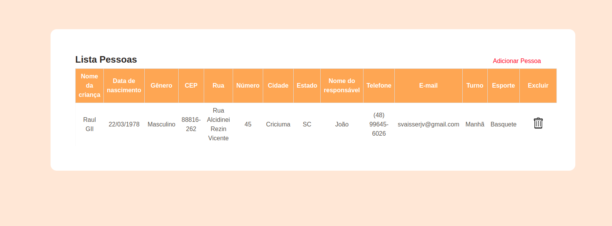
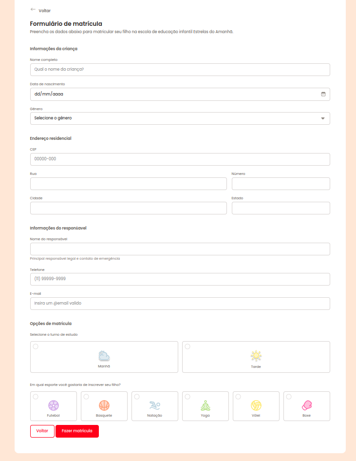

<h1 align="center"> Lista de Alunos </h1>

Para os meus primeiros passos com o Angular.JS decidi unir o que sabia de formularios para formar esse cadastro de alunos que salva os dados em um arquivo.json.

  

## 🚀 Tecnologias

Esse projeto foi desenvolvido com as seguintes tecnologias:

- HTML e CSS
- AngularJS
- JavaScript
- Git e Github

  

